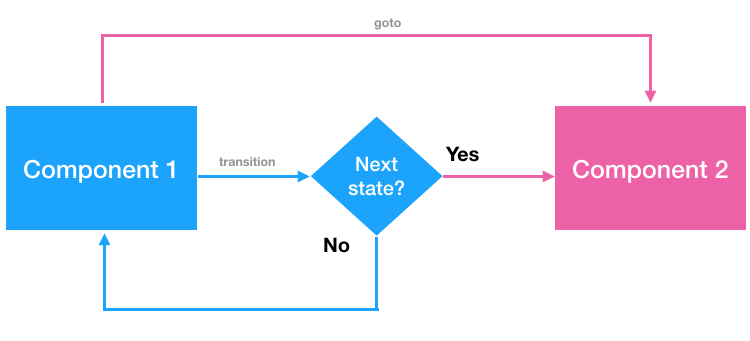

# React State Machine

[](https://www.npmjs.com/package/react-states-machine)
[](http://npm-stat.com/charts.html?package=react-states-machine)
[](https://github.com/bredele/contributing-guide/blob/master/community.md)

Inspired by [mood](https://github.com/bredele/mood) this module is using the well known [finite state machine](https://en.wikipedia.org/wiki/Finite-state_machine) pattern to alleviate some of the issues that crop up in complex React applications by strictly separating the management of states from your components. This module stay true to the original intent behind React:
  - Describe states as static components only (dynamic relationships within a component are expressed outside of the component itself)
  - Describe the logic for handling changes/updates as simple functions (called transitions).
  - Describe changes as plain objects to pass well defined and thought props.

[Try online!](https://codesandbox.io/s/7jn717on4x)


In addition, this module makes easy to:
  - develop stateless components (easier to understand and maintain)
  - develop components in isolation (easier to reuse and scale)
  - test components (dynamic relationships between components are tested separately)
  - manage asynchronous changes (props can be resolved by promises)



## Usage

A state is made of a component as well as a set of actions to be executed (called transitions). Those actions are called through transitions events and either update the current state or display a new state. A transition manages changes by passing props to the wanted state. Here's a simple example of navigation flow using react-states-machine:


```js
import machine from 'react-states-machine'

function NavigationFlow (attrs) {
  return (
    <section>
      {
        machine({
          // welcome state
          'welcome': [
            props => <button onClick={() => props.transition('click')}>Welcome</button>,
            {
              // click event transition from welcome state to next state with a new message prop
              'click': [() => ({message: 'Hello you!'}), 'next']
            }
          ],
          // next state
          'next': [
            props => {
              return (
                <div>
                  <button onClick={() => props.goto('welcome')}>previous</button>
                  {props.message}
                  <button onClick={() => props.transition('update')}>next</button>
                </div>
              )
            },
            {
              // update event update next state with new message prop after 1 second
              'update': [() => new Promise(resolve => setTimeout(() => resolve({ message: 'This is awesome!' }), 1000))]
            }
          ]
        }, attrs)
      }
    </section>
 )
}
```

## Getting started

A state machine is an object describing your application/component states.

```js
machine({
  state: [
    component,
    transitions
  ]
})
```

A state is composed of a component as well as an optional object containing transitions to mutate this component. Here's an example that shows how to style an input when empty using a transition called `validity`:

```js
machine({
  'inputState': [
    props => <input className={props.invalid ? 'invalid' : ''} onChange={e => props.transition('validity', e.target.value)}/>,
    {
      'validity': [(prev, value) => {
        return {
          invalid: !value
        }
      }]
    }
  ]
})
```

A transition is a function used to pass props to your component and update it. This function can return any types as well as promises (transition is resolved with the promise).

A transition is also useful to describe the passage to an other state. Here's an example:

```js
machine({
  'formEmail': [
    props => {
      return (
        <div>
          <input type="email" />
          <button onClick={() => props.transition('next')}>next</button>
        </div>
      )
    },
    {
      next: [() => ({name: 'John Doe'}), 'formPassword']
    }
  ],
  'formPassword': [
    props => {
      return (
        <div>
          <h2>Hello {props.name}</h2>
          <input type="password" />
          <button>connect</button>
        </div>
      )
    }
  ]
})
```

But you also can go to an other state without transition:

```js
machine({
  'formEmail': [
    props => {
      return (
        <div>
          <input type="email" />
          <button onClick={() => props.goto('formPassword')}>next</button>
        </div>
      )
    }
  ],
  'formPassword': [
    props => {
      return (
        <div>
          <h2>Hello {props.name}</h2>
          <input type="password" />
          <button>connect</button>
        </div>
      )
    }
  ]
})
```

Check out [our test suite](./test/react-states-machine.test.js) for more information.

## Installation

```shell
npm install react-states-machine --save
```

[](https://nodei.co/npm/react-states-machine/)


## Question

For questions and feedback please use our [twitter account](https://twitter.com/bredeleca). For support, bug reports and or feature requests please make sure to read our
<a href="https://github.com/bredele/contributing-guide/blob/master/community.md" target="_blank">community guideline</a> and use the issue list of this repo and make sure it's not present yet in our reporting checklist.

## Contribution

This is an open source project and would not exist without its community. If you want to participate please make sure to read our <a href="https://github.com/bredele/contributing-guide/blob/master/community.md" target="_blank">guideline</a> before making a pull request. If you have any react-states-machine related project, component or other let everyone know in our wiki.


## Licence

The MIT License (MIT)

Copyright (c) 2016 Olivier Wietrich

Permission is hereby granted, free of charge, to any person obtaining a copy
of this software and associated documentation files (the "Software"), to deal
in the Software without restriction, including without limitation the rights
to use, copy, modify, merge, publish, distribute, sublicense, and/or sell
copies of the Software, and to permit persons to whom the Software is
furnished to do so, subject to the following conditions:

The above copyright notice and this permission notice shall be included in all
copies or substantial portions of the Software.

THE SOFTWARE IS PROVIDED "AS IS", WITHOUT WARRANTY OF ANY KIND, EXPRESS OR
IMPLIED, INCLUDING BUT NOT LIMITED TO THE WARRANTIES OF MERCHANTABILITY,
FITNESS FOR A PARTICULAR PURPOSE AND NONINFRINGEMENT. IN NO EVENT SHALL THE
AUTHORS OR COPYRIGHT HOLDERS BE LIABLE FOR ANY CLAIM, DAMAGES OR OTHER
LIABILITY, WHETHER IN AN ACTION OF CONTRACT, TORT OR OTHERWISE, ARISING FROM,
OUT OF OR IN CONNECTION WITH THE SOFTWARE OR THE USE OR OTHER DEALINGS IN THE
SOFTWARE.
